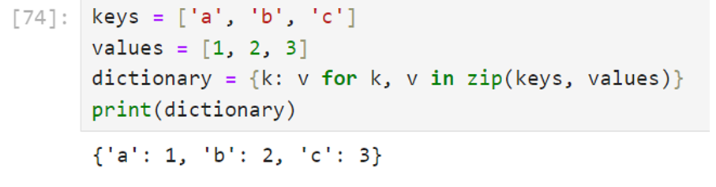

# Week 5 - Activity 1: Zip function - Dictionary data type - Tips and tricks

Develop the following code and share a screenshot of your result here after adding one more key, "d", to the key list. 

 